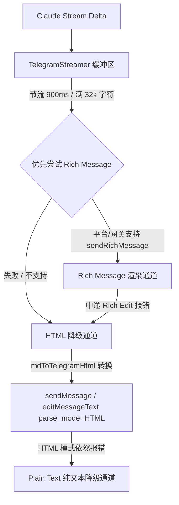

# CoBot 消息 Markdown 渲染机制总结

本文档详细总结了 CoBot 项目中将 Claude Code 产生的 CommonMark/GFM 格式 Markdown 流式（Stream）渲染并发送至 Telegram 聊天的完整技术实现。

---

## 1. 背景与核心挑战

在 Telegram 中流式输出富文本（Markdown）存在以下技术挑战：

1. **`MarkdownV2` 解析模式的严苛限制**：
   Telegram 原生的 `MarkdownV2` 要求转义 19 种特殊字符（如 `_`, `*`, `[`, `]`, `(`, `)`, `~`, `` ` ``, `>`, `#`, `+`, `-`, `=`, `|`, `{`, `}`, `.`, `!`）。在流式传输（Streaming）过程中，由于缓冲区经常停留在 Markdown 标记的中间（例如输出了 `**bold` 但尚未收到结尾的 `**`），`MarkdownV2` 会直接抛出 `can't parse entities` 错误并拒绝整条消息。
2. **`HTML` 解析模式的局限**：
   Telegram 的 HTML 模式容错率高（仅需转义 `&`, `<`, `>`，未配对标记当做普通字符渲染），但其支持的 HTML 标签极其精简（仅支持 `<b>`, `<i>`, `<u>`, `<s>`, `<code>`, `<pre>`, `<a href="">`, `<blockquote>`, `<tg-spoiler>`），原生不支持 GFM 表格、LaTeX 数学公式、 Tasklist 等高级 Markdown 特性。
3. **频率限制与并发保护**：
   频繁调用 Telegram 的 `editMessageText` API 极易触发 `429 Too Many Requests` 限频，必须进行缓冲节流（Throttling）与串行发送队列控制。

为了平衡**流式渲染的高容错性**与**富文本的最佳展示效果**，CoBot 实现了**双轨（Rich Message / HTML Fallback）渲染管道**与**中间态 Markdown 修复算法**。

---

## 2. 整体架构与双轨降级管道 (Dual-Transport Fallback)

消息发送由 `TelegramStreamer` (`src/bot/streaming.ts`) 统一调度，采用三级降级链路：



### 降级与模式锁定 (Mode Settling)
- **探针锁定**：在首次 Flush 时，`TelegramStreamer` 会尝试调用 API 的 `sendRichMessage` 接口。若成功，将 `richMode` 设为 `true`；若失败（如第三方网关不支持 Rich 结构），降级至 `HTML` 模式并将 `richMode` 设为 `false`。
- **单向锁定（No Flip-Flop）**：一旦传输模式确定，在同一个流式会话中不会反向切换，保证编辑状态连续一致。

---

## 3. 核心模块与实现细节

### 3.1 `TelegramStreamer` (`src/bot/streaming.ts`)

负责流式文本的缓冲、节流、中间态修复以及 Telegram 消息编辑。

#### 主要特性：
1. **缓冲与节流 (Throttling & Chunking)**：
   - 默认节流间隔 `flushMs = 900ms`，减少 API 编辑频率。
   - 超过 `maxEditChars = 32000` 字符时自动截断并开辟新消息发送。
2. **串行 Promise 链 (Enqueue Chain)**：
   - 所有的 `sendMessage` 与 `editMessageText` 操作都通过 `this.chain = this.chain.then(...)` 串行化，防止并发请求导致消息顺序错乱或 API 限流。
3. **流式 Markdown 修复 (`sanitizeStreamMarkdown`)**：
   在将中间态文本发送给 Rich Message 解析器之前，先进行结构修复：
   - **自动闭合代码块**：检测未成对的 ```` ``` ```` 或 `~~~` 代码块，在末尾临时追加闭合标记，避免 Rich 渲染器解析崩溃。
   - **转义未闭合行内符号**：如末尾孤立的反引号（` ` ` -> ` \` `）或未完成的链接（`[text](url...` -> `\[\`）。
4. **整体替换渲染 (`setContent`)**：
   与 `text()` 的「追加 token 增量」不同，`setContent(text)` 每次调用都用一个**调用方已拼好的完整字符串**重渲染整条逻辑消息——用于「逐 tick 增长的已完成块列表」这类场景（例如 `showTraceText` 开启时，每个工具边界把已完成的叙述块重新渲染成 `**执行过程**` 子弹列表）。它同样标记 dirty 并走节流 flush，所以连续快速调用会合并成一次编辑；对空输入和 `finalize()` 之后的调用都是 no-op，因此调用方可以无条件每 tick 驱动它，只有非空渲染才真正发送。
5. **结尾按钮回挂 (`finalize(replyMarkup)`)**：
   Rich Message 会**静默丢弃 `reply_markup`**（按钮在 rich 消息上不渲染，与 `sendRichText` 同一坑）。因此 `finalize()` 在最后一次 flush 之后，对 Rich 模式下的最后一条消息调用 `editMessageReplyMarkup` 重新挂上键盘，失败时再降级为**单独发送一条携带按钮的普通消息**（文案 `💡 建议的下一步操作：`）。其中 `Bad Request: message is not modified`（按钮已挂上）被视为良性错误直接吞掉。`finalize()` 带幂等保护——`finally` 安全网里的二次调用不会重复发消息或重复挂按钮。HTML/纯文本模式自带 `reply_markup`，此分支 no-op。

### 3.2 `mdToTelegramHtml` 转换引擎 (`src/util/tgfmt.ts`)

当 Rich Message 不可用时，由 `mdToTelegramHtml` 将 CommonMark/GFM Markdown 转换为符合 Telegram HTML 规范的字符串。

#### 语法映射与处理策略：

| Markdown 语法 | 转换后的 Telegram HTML 形式 | 说明 / 实现逻辑 |
| :--- | :--- | :--- |
| **Fenced Code** (` ```lang `) | `<pre>escaped_code</pre>` | 保留缩进与换行，自动转义 `<>&`。中间态未闭合时自动补充 `</pre>` |
| **Inline Code** (`` `code` ``) | `<code>escaped_code</code>` | 单次扫描，遇到未闭合的反引号时渲染为字面量 `&#96;` |
| **Bold** (`**text**`, `__text__`) | `<b>inline(text)</b>` | 支持嵌套行内格式 |
| **Italic** (`*text*`, `_text_`) | `<i>inline(text)</i>` | 带有单词边界检查，避免误触 `my_var_name` 中的下划线 |
| **Strikethrough** (`~~text~~`) | `<s>inline(text)</s>` | 转换为 `<s>` 标签 |
| **ATX Headings** (`# Title`) | `<b>inline(title)</b>` | Telegram 无 H1~H6 标签，统一加粗渲染 |
| **Blockquote** (`> quote`) | `<blockquote>inline(quote)</blockquote>` | 连续 `>` 行合并为单个引用块 |
| **Lists** (`- item`, `* item`) | `• inline(item)` | 无序列表项统一替换为 Unicode 符号 `• ` |
| **Horizontal Rule** (`---`) | `────────────────` | 替换为 16 个 Unicode 横线字符 |
| **GFM Tables** (`\| A \| B \|`) | **文本行格式化 (见下方)** | 转换成 `<b>A</b> · <b>B</b>` 格式化文本行 |
| **Links** (`[text](url)`) | `<a href="cleaned_url">inline(text)</a>` | 通过 `cleanUrl` 拦截 `javascript:` / `data:` 等危险 Scheme |

#### GFM 表格转换算法 (`parseTable`)：
由于 Telegram HTML 不支持 `<table>` 标签，转换器自动识别 GFM 表格分隔行（如 `|:---|---:|`），并将表格重构为格式化多行文本：
- **表头行**：所有单元格全部加粗，用 ` · ` 分隔，例如：`<b>Header 1</b> · <b>Header 2</b>`
- **数据行**：首列单元格加粗，其余列正常渲染，例如：`<b>Row 1</b> · Value 2`

---

### 3.3 工具调用格式化 (Tool Interception Formatting)

在 `runTurn` (`src/bot/runs.ts`) 驱动 Claude 执行时，工具调用及返回结果会插入流式缓冲区：
- **工具触发**：`toolLine` 渲染为 `\n\n🔧 **tool_name** › summary`
- **工具结果**：`toolResult` 渲染为 `\n\n↳ **tool_name** · truncated_output`（错误结果带有 `⚠️` 前缀，并通过 `escapeMd` 转义特殊标点）。

---

### 3.4 执行过程展示 (`showTraceText`)

当 `config.claude.showTraceText` 开启时，`runTurn` 会额外用 `setContent()` 驱动一条「执行过程」消息：每个工具边界把已 flush 的叙述文本块（`text` trace 事件）经 `toBulletList` 渲染成无序列表，逐块累加并以 `---` 分隔，**仅展示已完成块**——进行中的当轮文本留在缓冲区，直到下一个边界才出现，因此最终答案永远不会在流中途闪现（否则会在 done 时被折叠/重排）。运行结束时，`buildTraceReply()` 把完整的「过程列表 + 摘要」合并为一条消息，并通过 `finalize(replyMarkup)` 挂上下一步按钮；异常/中止/轮数耗尽时由 `finally` 分支兜底 `finalize()`，把最后一次渲染钉为最终状态。

---

## 4. 关键代码流程示意

```typescript
// 1. 初始化流式器
const streamer = new TelegramStreamer(api, chatId, maxEditChars, flushMs);

// 2a. 追加式：接收 Claude 输出 delta 并加入缓冲区
await streamer.text(ev.delta);

// 2b. 整体替换式（showTraceText 开启时，每个工具边界重新渲染已完成块列表）
await streamer.setContent(renderLiveTrace());

// 3. 定时或满额触发 flush() —— 优先尝试 Rich Message
const safeMd = sanitizeStreamMarkdown(buffer);
await api.sendRichMessage(chatId, { markdown: safeMd });

// 4. 降级路径 (Fallback to HTML)
const html = mdToTelegramHtml(buffer);
await api.sendMessage(chatId, html, { parse_mode: "HTML" });

// 5. 收尾：把下一步按钮挂到 Rich 消息上（rich 模式静默丢按钮）
await streamer.finalize(replyMarkup);
```

---

## 5. 源码目录索引

- **`src/bot/streaming.ts`**：`TelegramStreamer` 缓冲管理、节流控制、Rich/HTML 发送状态机、`sanitizeStreamMarkdown`、`setContent`、`finalize` 按钮回挂。
- **`src/util/tgfmt.ts`**：`mdToTelegramHtml` 转换逻辑、`parseTable` 表格转换、`inline` 语法扫描器、`escapeMd` 安全转义。
- **`src/util/send.ts`**：`sendRichText` / `sendRichMessage` 发送封装与降级（同样处理 rich 模式丢按钮的坑）。
- **`src/bot/runs.ts`**：对接 Claude 驱动层事件与流式器；`showTraceText` 下的实时过程消息与 `buildTraceReply` / `toBulletList`。
- **`src/bot/streaming.test.ts` & `src/util/tgfmt.test.ts`**：流式格式化与转换引擎的单元测试集（含 `setContent` 替换语义、`finalize(replyMarkup)` 回挂/降级/幂等）。
